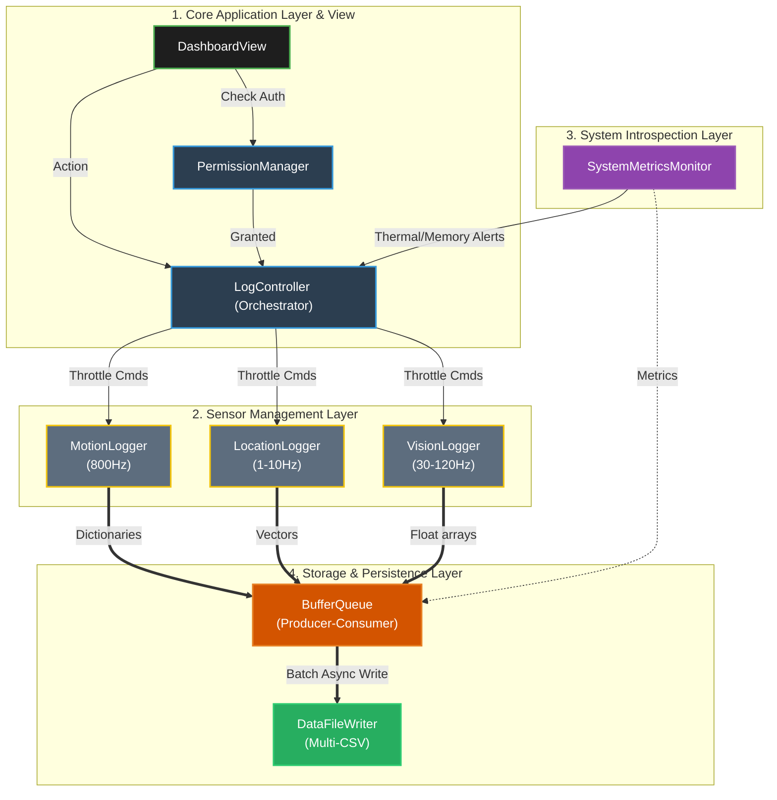

# iPhone 16 Pro Multi-Modal Logger: Edge AI Testbed 📱⚡️

[](https://swift.org)
[](https://developer.apple.com/ios/)
[]()
[](LICENSE)

A lightweight, minimal, yet powerful multi-modal sensor logging application designed specifically for the **iPhone 16 Pro**.

This project serves as a **Sensory-Motor Loop Testbed**. By capturing raw, high-frequency sensory data (Exteroception/Proprioception) alongside active motor interventions and internal health metrics (Interoception), it provides a comprehensive dataset to analyze hardware reactions in real-world "Chaos" conditions. Currently in **Phase 3: Active Sensing Integration**.

---

## 🌟 Key Features

- **Offline-First & Graceful Degradation**: Operates completely offline to observe pure hardware limits. Instead of preventing frame drops, the app explicitly captures frequency fluctuations $X(t)$ caused by CPU load and thermal throttling.
- **Multi-CSV Architecture**: Eliminates I/O lock contention by isolating $800Hz$ motion data and $1Hz$ GPS data into independent, highly efficient asynchronous CSV streams.
- **Comprehensive Sensor Coverage**:
  - **Motion**: `800Hz` Accelerometer & `200Hz` HDR Gyroscope.
  - **Vision & AR**: `ARKit` Face Tracking (BlendShapes), LiDAR Mesh, and Raw Camera metadata.
  - **Auditory**: Studio-quality Mic levels (dBFS) and Audio Mix metadata.
  - **Environment**: Barometer, Ambient Light Sensor (ALS), and Color Spectrum.
  - **Location**: Dual-Frequency GPS (L1+L5) and precise Magnetometer data.
  - **Context**: `thermalState`, Battery, CPU/Mem load.
- **Active Intervention & Actuators**:
  - **Flash/Torch**: Torch intensity control (0-1.0) for ALS & Vision stress testing.
  - **Active Lens**: Locking exposure/focus and zoom control for Active Vision research.

---

## 🧪 Testing Methodology (The Core Value)

The true value of this testbed lies in its two-phased testing methodology, designed to capture both the "ideal" hardware limits and "chaos" states:

- **Phase 1: Isolating & Ideal State**
  - Toggle specific sensors individually using the dashboard switches.
  - **Goal**: Validate baseline pipeline integrity and observe hardware capabilities at ideal constant frequencies ($C$ Hz) with near-zero latency.
- **Phase 2: Global Stress Test & Logging All Data**
  - Trigger the 🔴 **[LOGGING ALL DATA]** button to ignite all sensors simultaneously.
  - **Goal**: Force memory buffer overflows and thermal state spikes (`Serious` / `Critical`). This induces OS scheduling delays, causing high-frequency data to drop and warp into irregular $X(t)$ time-series data—perfectly simulating real-world sensor interference and Jitter.
- **Phase 3: Active Sensing & Intervention**
  - Use the **Actuators** panel to trigger flash pulses while logging.
  - **Goal**: Measure how controlled physical interventions (Motor Commands) affect sensor noise and how models can filter out self-induced artifacts.
- **Phase 4: Data Visualization & Analysis**
  - Export the logs to Python/Jupyter to visualize the correlation between `thermal_state`, `actuator_events`, and data `dropout`. This noisy context perfectly simulates real-world hardware limits.
- **Phase 5: Frequency Modulation & Jitter Analysis (Proprioception/IMU ONLY)**
  - Use the **[TESTING VARYING FREQUENCY]** button to randomly modulate the target frequency ($100Hz \leftrightarrow 800Hz$).
  - **Target Limitation**: Dynamically modulating the target frequency is _only supported for Proprioceptive IMU (Accelerometer & Gyroscope)_. Exteroceptive sensors (ARKit/Vision, Audio, GPS) run on fixed polling engines or hardware-locked intervals dictated by Apple's Core frameworks and cannot be artificially modulated in real-time without severely dropping pipeline integrity.
  - **Goal**: Analyze the hardware's settling time and the discrepancy between requested $C$ and actual $X(t)$ under dynamic load for CoreMotion inputs.

---

## 📊 Data Classification Schema & Expected Frequency
The logged data is classified into three sensory-motor categories. The table below outlines the specific data items, their target frequency, and the actual experimental frequencies observed during stress testing.

| Category           | Sub-Category    | Data Points                                                                        | Target Hz           | Experimental Range         | Log File Prefix                       |
| :----------------- | :-------------- | :--------------------------------------------------------------------------------- | :------------------ | :------------------------- | :------------------------------------ |
| **Exteroception**  | **Vision**      | Face BlendShapes (52 pts), LiDAR Scene Mesh, Camera Metadata (ISO, Exposure, Lens) | 60Hz / 15Hz / 30Hz  | 60Hz / 15Hz / 30Hz (Fixed) | `extero_vision_*`                     |
|                    | **Auditory**    | Microphone Peak & Average Power (dBFS)                                             | 10Hz                | 10Hz (Fixed)               | `extero_audio_mic`                    |
|                    | **Spatial**     | Lat/Lon, GPS Heading, Digital Compass                                              | 1Hz / 30Hz          | 1Hz / ~30Hz (Fixed)        | `extero_gps_*`                        |
|                    | **Environment** | Barometric Pressure, Lux Proxy                                                     | 10Hz / 1Hz          | ~10Hz / ~1Hz (Fixed)       | `extero_env_*`                        |
| **Proprioception** | **IMU**         | Accelerometer (x,y,z), Gyroscope (pitch,roll,yaw), Motion Activity                 | 800Hz / 200Hz / 1Hz | **Variable (0-800Hz)**     | `proprio_imu_*`<br>`proprio_motion_*` |
|                    | **Actuator**    | LED Torch Intensity, Zoom Factor, Exposure Lock                                    | Event-based         | Event-based                | `proprio_actuator_*`                  |
| **Interoception**  | **Health**      | CPU, GPU, ANE, Thermal State, Mem (MB), Battery                                    | 1Hz                 | 1Hz                        | `intero_sys_health`                   |

---

## ⏱ Time-Series Minimum Schema

To perfectly map delays, jitters, and dropouts, every single row across all Multi-CSV files enforces a strict meta-schema layer:

| Column          | Description & Analysis Purpose                                                                                         |
| :-------------- | :--------------------------------------------------------------------------------------------------------------------- |
| `hw_timestamp`  | Hardware-level creation time. Used to calculate real frequency $X(t)$ and **Jitter**.                                  |
| `sys_timestamp` | OS/App-level arrival time. <br/>`sys_timestamp` - `hw_timestamp` = **OS Scheduling Delay**.                            |
| `target_hz`     | The target frequency requested ($C$). Used to monitor the control signal.                                              |
| `sys_hz`        | The software-observed arrival frequency in the app layer. <br/>`target_hz` - `sys_hz` = **App Scheduling Starvation**. |
| `thermal_state` | Real-time device temp (`0: Nominal` to `3: Critical`). Correlates heat with **Data Dropout** and **Jitter**.           |

---

## 🏗 Architecture Layers

The app is decoupled into four primary layers to guarantee UI thread stability while ingesting thousands of events per second:

1. **Core Application Layer**: SwiftUI Dashboard, Permission Manager, and central `LogController` Orchestrator.
2. **Sensor Management Layer**: Independent provider classes (`MotionLogger`, `LocationEnvironmentLogger`, `VisionAudioLogger`).
3. **System Introspection Layer**: Monitors device health (`SystemMetricsMonitor`) to trigger feedback loops.
4. **Storage & Persistence Layer**: A non-blocking `BufferQueue` mapped into a `DataFileWriter` (Multi-CSV format).



## 🛠 How to Build & Run (Physical Device)

> [!IMPORTANT]
> This app **must** be run on a physical iPhone (iPhone 16 Pro recommended) to capture real hardware/thermal characteristics. The Simulator will not provide accurate sensor data or jitters.

### 1. Xcode Setup & Code Signing

1. Open `iphoneLogger.xcodeproj` in Xcode.
2. Select the **iphoneLogger** target in the project navigator.
3. Go to the **Signing & Capabilities** tab.
4. Select your **Development Team**.
5. When you first build (⌘+R), a macOS security prompt for `codesign` may appear:
   - Click **"Always Allow"** to prevent repeated password prompts during development.

### 2. Trusting the Developer App (On iPhone)

After the first successful build, the app will install but won't run until trusted:

1. On your iPhone, go to **Settings > General > VPN & Device Management**.
2. Tap your **Apple ID** under "Developer App".
3. Tap **"Trust [Your Email]"** and confirm.

### 3. Accessing Logged Data

The app saves data in a non-blocking Multi-CSV format. You can access these files directly on your device:

1. Open the **"Files"** app on your iPhone.
2. Navigate to **Browse > On My iPhone > iphoneLogger**.
3. You will find separate `.csv` files for each sensor (e.g., `motion_accel_...csv`, `motion_gyro_...csv`).
4. These can be shared via **AirDrop**, Email, or iCloud Drive for analysis in Jupyter/Python.

---

## 📁 Directory Structure

```text
iphoneLogger/
├── README.md              # Project overview and instructions
├── docs/                  # Planning and design documents (PRD, UX/UI, Arc. Diagram)
├── App/                   # App entry point and lifecycle management
├── Managers/              # Sensor core modules (Motion, Location, Vision, etc.)
├── Models/                # Data schemas and model definitions
├── Utils/                 # Utility functions (file saving, formatting, export)
└── Views/                 # SwiftUI dashboard and UI components
```

## 📄 License & Contribution

This project is licensed under the Apache 2.0 License - see the [LICENSE](LICENSE) file for details.
Pull Requests are extremely welcome! If you find a new private API or a more efficient logging pipeline, please feel free to contribute.

---

_Disclaimer: Heavy logging of high-frequency sensors will drain battery quickly and purposely increase device temperature for stress testing. Use with caution._
